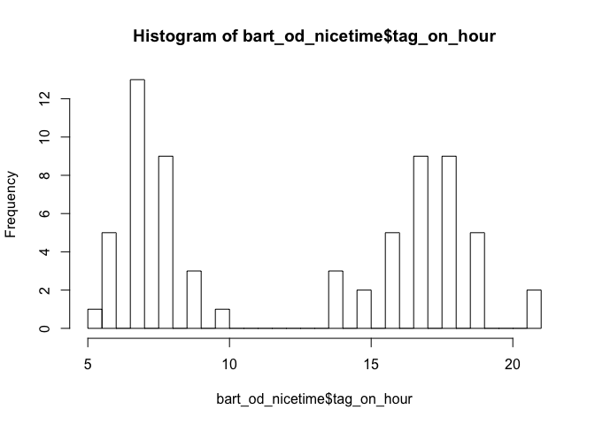

clpr
================

-   [Goal](#goal)
-   [Dependencies](#dependencies)
-   [Installation](#installation)
-   [Setup](#setup)
-   [Testing](#testing)
-   [Example Usage](#example-usage)
-   [Contributing](#contributing)
-   [2014 By-Operator Transfer Summary](#by-operator-transfer-summary)
-   [Examples](#examples)
-   [Deprecated Examples](#deprecated-examples)

This is an [R package](http://kbroman.org/pkg_primer/) with analysis utilities and approaches for a data set of obscured and anonymized Clipper smart card transactions.

Goal
====

This package can be used to support documentation and collaboration around the analysis of anonymized Clipper trip data with extensible, open-source, industry-standard data analysis tools like [RStudio](https://en.wikipedia.org/wiki/RStudio).

It can be used to help answer questions like the following:

1.  What are Station-to-Station Tabulations for Fixed-Guideway systems?
2.  What are Major Transfer Movements?

For example:   
-   BART to/from MUNI      
-   Ferry Service to BART      
-   The above movements are (ideally) station and route specific    

https://github.com/BayAreaMetro/DataServices/tree/master/Project-Documentation/clipper

Dependency
============

The DV Data Lake schemas `clipper` and `clipper_sandbox1` are the major dependency of this package. Some limited documentation for those schemas can be found [here](https://github.com/BayAreaMetro/DataServices/tree/master/Project-Documentation/clipper). 

Installation
============

``` r
if (!require(devtools)) {
    install.packages('devtools')
}
devtools::install_github('bayareametro/clpr')
```

This package has a number of dependencies, the major ones being the `tidyverse` and `RPostgres`

We've tested it on an MTC Windows 10 machine and Mac OS Sierra and it seems to work on both, though we need to do more testing.

Setup
=====

If you [define environmental variables](https://stat.ethz.ch/R-manual/R-devel/library/base/html/Sys.setenv.html) for the database, you can use the `connect_rs()` function to connect to the database. See expected variable names in [R/connect\_db.R](R/connect_db.R)

Otherwise, you'll have to connect to the db as you prefer.

Testing
=======

If you set environmental variables as above, you can run some of the (admittedly not complete) tests with Ctrl/Cmd + Shift + T or `devtools::test().`

Example Usage
=============

Sample a day of transactions by user

Note that date must be formatted as below for now. YYYY-MM-DD

Note that we source a local R script that defines the database connection details.

``` r
library(DBI)
library(dbplyr)
library(dplyr)
library(clpr)
source("~/Documents/connect_db.R")
rs <- connect_rs()
date <- "2016-04-25"
transactions_tbl <- sample_day_of_transactions(rs,date,n_users=100)
transactions_df <- as_tibble(transactions_tbl)
```

First, let's use the `drop_tagons` function to change the unit of observation from transactions to rides, where a ride is a ride on an operator.

``` r
rides_df <- drop_tagons(transactions_df)
```

We can also create a dataframe summarizing transfers within a given time window (in minutes), using the `create_transfer_df` function.

``` r
transfer_df <- create_transfer_df(rides_df, 120) #120 minutes
knitr::kable(transfer_df)
```

| participantname.transfer | participantname     |  from\_operator\_id|  to\_operator\_id|  num\_transfers|  num\_discounted|  transfer\_revenue|
|:-------------------------|:--------------------|-------------------:|-----------------:|---------------:|----------------:|------------------:|
| BART                     | East Bay            |                   4|                 8|               0|                0|                  0|
| BART                     | SF Muni             |                   4|                18|               0|                0|                  0|
| Caltrain                 | SF Muni             |                   6|                18|               0|                0|                  0|
| East Bay                 | BART                |                   8|                 4|               0|                0|                  0|
| Golden Gate Transit      | Golden Gate Transit |                  11|                11|               0|                0|                  0|
| SF Muni                  | BART                |                  18|                 4|               0|                0|                  0|

Alternatively, we can use the `bart_transactions_as_transfers` function to change the unit of observation from transactions to rides on BART only, with additional information about the rides that individuals may have taken before or after boarding BART. For example, taking a ferry and then BART.

``` r
bart_od <- bart_transactions_as_transfers(transactions_df)
```

The outcome includes the time of the previous transaction to BART tag-on. For example, a user tagged off of the ferry at 7:05 and then onto BART at 7:20. Or, a user tagged onto an SF Muni bus at 7:00 and then onto BART at 7:30. It also includes the time they tagged onto the following ride.

We can use the convenience function `spread_time_column` to spread the timestamp column into day of year, month, hour, and minute integers.

``` r
out_time_df <- spread_time_column(bart_od$transaction_time, prefix="tag_out_")
in_time_df <- spread_time_column(bart_od$time_of_previous, prefix="tag_on_")
bart_od_nicetime <- cbind(bart_od,in_time_df,out_time_df)
```

This can make working with the time data easier. For example, plotting a histogram of the tag on hour.

``` r
hist(bart_od_nicetime$tag_on_hour, breaks=24)
```



We can also pull a full day of transactions using `day_of_transactions`.

``` r
rs <- connect_rs()
date <- "2016-04-25"
transactions_tbl <- day_of_transactions(rs,date)
transactions_df <- as_tibble(transactions_tbl)
time_df <- spread_time_column(transactions_df$transaction_time, prefix="trnsct_")
transactions_df <- cbind(transactions_df,time_df)
```

``` r
hist(transactions_df$trnsct_hour, breaks=24)
```


Then we can calculate the average number of transactions per product type in the day:

``` r
rides_df <- drop_tagons(transactions_tbl)

rides_df <- get_product_description(rides_df)

rides_per_user <- rides_df %>%
  group_by(cardid_anony,product_description) %>%
  transmute(total_rides=n())

rides_per_type <- rides_per_user %>%
  group_by(product_description) %>%
  summarise(mean_rides=mean(total_rides))

knitr::kable(arrange(rides_per_type,mean_rides))
```

| product\_description                            |  mean\_rides|
|:------------------------------------------------|------------:|
| AC Transit Senior/Disabled Local Monthly Pass   |     4.544394|
| SF Muni RTC Monthly Pass                        |     4.666268|
| East Bay Regional RTC Local 31-Day Pass         |     5.000000|
| VTA Express ECO Pass                            |     5.080000|
| VTA Senior / Disabled Monthly Pass              |     5.089205|
| East Bay Regional Adult Local 31-Day Pass       |     5.100457|
| SF Muni 3 Day Rolling Pass                      |     5.597938|
| FAST Route 90 Youth 31-day Rolling Pass         |     6.000000|
| WestCAT Senior 31-Day Pass                      |     6.000000|
| Santa Rosa CityBus S/D 31-day rolling pass      |     6.375000|
| FAST Route 90 Senior 31-day Rolling Pass        |     7.727273|

Contributing
============

You can contribute code, data, or questions. Please feel free to [open an issue](https://github.com/BayAreaMetro/clpr/issues) with any questions about how to use the package.

Examples
============
-   [travel-survey-verification](https://github.com/BayAreaMetro/Data-And-Visualization-Projects/tree/b4fea219ebb3c29ce9972b4e6f9853afa76161a7/travel-model-survey-verification)


Background 
=================================

### 2014 By-Operator Transfer Summary

This package is based on previous work on travel model verification. 

To help validate the MTC travel model, MTC (David Ory) summarized successive movements made by a single Clipper card within [pre-defined time windows](data-raw/transfer_rules_database.csv). We refer to these as transfers.

The main scripts [extract-data](vignettes/extract-data.Rmd), [create interactive pair-wise by tag time difference plots](vignettes/To-and-From-Interactive.Rmd), and [build a database of transfer summaries](vignettes/Build-Transfer-Database.Rmd).
