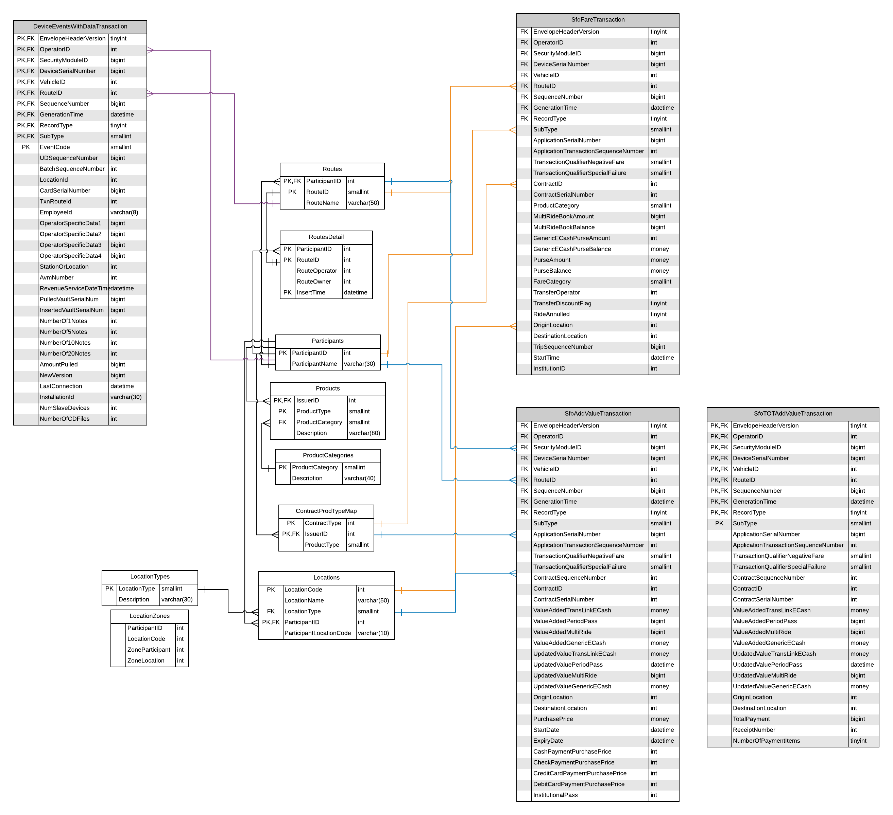

# Goal

Document the commonly used tables and fields in the clipper data lake for ad-hoc analytical projects.  

One of the key lessons learned from the [usf-practicum](https://github.com/BayAreaMetro/usf-practicum) was that the data lake tables need to be more fully documented in order to ease ad-hoc analytical work on clipper data. 

The primary goal of this directory is to:
* document tables and variable names  
* document relationships between tables  
* note idiosyncrasies of the data (missing values, etc)  

# Overview

## Entity Relationship Diagram

- 

## Tables

- [sfofaretransaction](sfofaretransaction.md)

# Project Documentation
